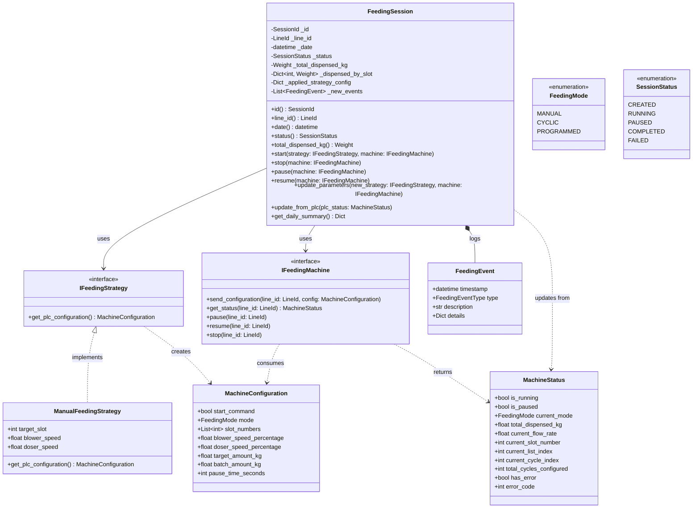

# Feeding Domain Classes (Detailed)

```mermaid
classDiagram
    class FeedingSession {
        -SessionId _id
        -LineId _line_id
        -datetime _date
        -SessionStatus _status
        -Weight _total_dispensed_kg
        -Dict~int, Weight~ _dispensed_by_slot
        -Dict _applied_strategy_config
        -List~FeedingEvent~ _new_events
        +id() SessionId
        +line_id() LineId
        +date() datetime
        +status() SessionStatus
        +total_dispensed_kg() Weight
        +start(strategy: IFeedingStrategy, machine: IFeedingMachine)
        +stop(machine: IFeedingMachine)
        +pause(machine: IFeedingMachine)
        +resume(machine: IFeedingMachine)
        +update_parameters(new_strategy: IFeedingStrategy, machine: IFeedingMachine)
        +update_from_plc(plc_status: MachineStatus)
        +get_daily_summary() Dict
    }

    class IFeedingStrategy {
        <<interface>>
        +get_plc_configuration() MachineConfiguration
    }

    class ManualFeedingStrategy {
        +int target_slot
        +float blower_speed
        +float doser_speed
        +get_plc_configuration() MachineConfiguration
    }

    class IFeedingMachine {
        <<interface>>
        +send_configuration(line_id: LineId, config: MachineConfiguration)
        +get_status(line_id: LineId) MachineStatus
        +pause(line_id: LineId)
        +resume(line_id: LineId)
        +stop(line_id: LineId)
    }

    class MachineConfiguration {
        +bool start_command
        +FeedingMode mode
        +List~int~ slot_numbers
        +float blower_speed_percentage
        +float doser_speed_percentage
        +float target_amount_kg
        +float batch_amount_kg
        +int pause_time_seconds
    }

    class MachineStatus {
        +bool is_running
        +bool is_paused
        +FeedingMode current_mode
        +float total_dispensed_kg
        +float current_flow_rate
        +int current_slot_number
        +int current_list_index
        +int current_cycle_index
        +int total_cycles_configured
        +bool has_error
        +int error_code
    }

    class FeedingEvent {
        +datetime timestamp
        +FeedingEventType type
        +str description
        +Dict details
    }

    class FeedingMode {
        <<enumeration>>
        MANUAL
        CYCLIC
        PROGRAMMED
    }

    class SessionStatus {
        <<enumeration>>
        CREATED
        RUNNING
        PAUSED
        COMPLETED
        FAILED
    }

    FeedingSession --> IFeedingStrategy : uses
    FeedingSession --> IFeedingMachine : uses
    FeedingSession *-- FeedingEvent : logs
    IFeedingStrategy <|.. ManualFeedingStrategy : implements
    IFeedingStrategy ..> MachineConfiguration : creates
    IFeedingMachine ..> MachineConfiguration : consumes
    IFeedingMachine ..> MachineStatus : returns
    FeedingSession ..> MachineStatus : updates from
```
