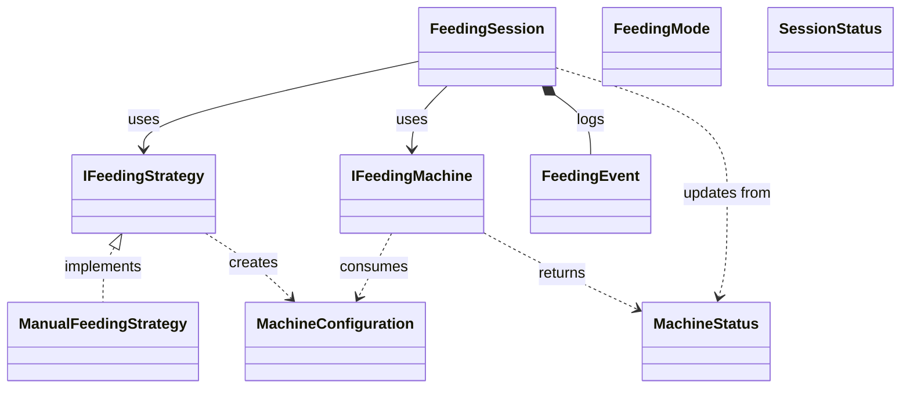

# Feeding Domain Classes (Simple)

```mermaid
classDiagram
    class FeedingSession
    class IFeedingStrategy
    class ManualFeedingStrategy
    class IFeedingMachine
    class MachineConfiguration
    class MachineStatus
    class FeedingEvent
    class FeedingMode
    class SessionStatus

    FeedingSession --> IFeedingStrategy : uses
    FeedingSession --> IFeedingMachine : uses
    FeedingSession *-- FeedingEvent : logs
    IFeedingStrategy <|.. ManualFeedingStrategy : implements
    IFeedingStrategy ..> MachineConfiguration : creates
    IFeedingMachine ..> MachineConfiguration : consumes
    IFeedingMachine ..> MachineStatus : returns
    FeedingSession ..> MachineStatus : updates from
```
