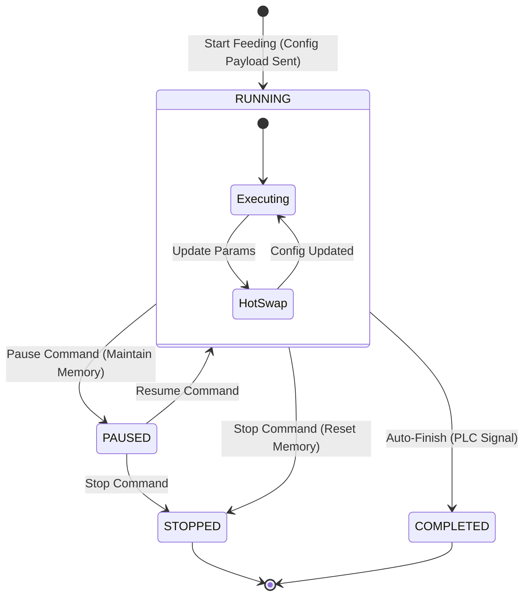

# Arquitectura del Dominio: Sistema de Control de Alimentación

**Versión:** 2.1 (Technical Developer Guide)  
**Contexto:** Bounded Context de Alimentación (Feeding Context)

Este documento detalla el diseño del dominio para el proceso de alimentación. El objetivo es guiar la implementación y mantenimiento del backend, asegurando la integridad transaccional y la correcta sincronización con el hardware (PLC).

---

## 1. Visión General de Arquitectura

El sistema sigue un enfoque **DDD (Domain-Driven Design)**. La lógica de negocio no reside en los controladores (API) ni en el servicio de hardware, sino en el **Modelo de Dominio**.

- **Pattern:** Orchestrator (Backend) -> Autonomous Executor (PLC).
- **Responsabilidad del Backend:** Gestión de sesión, validación de reglas de negocio, historización, traducción lógica-física y orquestación de comandos.
- **Responsabilidad del PLC:** Lógica de control en tiempo real (PID, timers), seguridad de hardware y ejecución de la configuración recibida.

---

## 2. Definición del Modelo de Dominio (Core)

A continuación se describen las clases estereotipadas que componen el núcleo de la solución.

### 2.1 Aggregate Root: `FeedingSession`

Representa la unidad de trabajo diaria de una línea de alimentación ("Día Operativo"). Es la entrada principal para cualquier cambio de estado.

- **Responsabilidad Principal:** Garantizar la consistencia transaccional del día.
- **Invariantes:**
  1. Solo puede existir una `FeedingSession` con estado `ACTIVE` por Línea.
  2. No permite iniciar una nueva operación si `current_operation` no es `None` o `COMPLETED/STOPPED`.
- **Gestión de Estado:** Controla la transición de día (cierre automático de sesiones de fechas anteriores).
- **Datos que agrupa:**
  - `operations`: Colección de todas las `FeedingOperation` del día.
  - `accumulators`: Contadores totales del día (`total_kg_dispensed`).

### 2.2 Entity: `FeedingOperation`

Representa una ejecución unitaria de alimentación sobre una jaula específica ("Visita"). Tiene un ciclo de vida finito.

- **Responsabilidad Principal:** Mantener el estado de una ejecución y su configuración aplicada.
- **Ciclo de Vida:** `RUNNING` -> `PAUSED` -> `RUNNING` -> `STOPPED` / `COMPLETED`.
- **Snapshotting:** Almacena una copia inmutable de la `MachineConfiguration` que se envió al PLC al momento del inicio (para auditoría).
- **Event Log:** Mantiene una lista interna de eventos (`started_at`, `paused_at`, `param_updated_at`).

### 2.3 Strategy Pattern: `IFeedingStrategy`

Abstracción para desacoplar la intención de negocio de la implementación física.

- **Rol:** Factory de configuraciones.
- **Input:** Intención lógica (Jaula UUID, Kilos Meta, Modo).
- **Output:** `MachineConfiguration` (Slots físicos, registros Modbus, Setpoints).
- **Implementaciones:**
  - `ManualFeedingStrategy`: Mapeo directo 1:1.
  - `CyclicFeedingStrategy` (Futuro): Lógica de distribución entre múltiples jaulas.

### 2.4 Value Objects & DTOs

Objetos inmutables para transporte de datos y configuración.

- **`MachineConfiguration` (Downlink DTO):** Estructura de datos plana que se serializa para enviar al PLC. Contiene: `target_slot`, `dosing_rate`, `blower_speed`, `target_weight`.
- **`MachineStatus` (Uplink DTO):** Estructura de lectura del PLC. Contiene: `current_weight`, `alarms`, `motor_status`.

---

## 3. Máquina de Estados y Control de Flujo

Es crítico diferenciar las transiciones de estado, ya que implican comportamientos distintos en el hardware.

### 3.1 STOP vs. PAUSE (Diferencia Técnica)

| Característica          | PAUSE / RESUME                                                                         | STOP                                                                       |
| :---------------------- | :------------------------------------------------------------------------------------- | :------------------------------------------------------------------------- |
| **Persistencia PLC**    | **RAM Retained:** El PLC mantiene los contadores y punteros de instrucción en memoria. | **Reset:** El PLC limpia los contadores de la operación actual.            |
| **Instrucción Enviada** | Señal booleana (Bit Trigger). No se reenvía payload de configuración.                  | Señal booleana de terminación.                                             |
| **Estado de Dominio**   | Transición a `PAUSED`. La operación sigue siendo la `current_operation`.               | Transición a `STOPPED`. La operación se desacopla (current pasa a `null`). |
| **Semántica**           | "Congelar tiempo".                                                                     | "Destruir contexto de ejecución".                                          |

### 3.2 Diagrama de Estados (Mermaid)

# 4. Flujos de Implementación (Use Cases)

Guía para implementar los servicios de aplicación (Application Services).

## 4.1 UC: Iniciar Alimentación (StartFeeding)

- **Repo**: Obtener o crear `FeedingSession` (gestión de Day Boundary).
- **Domain Check**: `session.can_start_operation()?` → Lanza excepción si hay operación activa.
- **Strategy**: `strategy.resolve_configuration(request)` → `MachineConfiguration`.
- **Hardware I/O**: `plc_service.write_configuration(config)`.  
  **Punto Crítico**: Escritura asíncrona.
- **Domain Update**: `session.start_new_operation(config)`.
- **Persistence**: Guardar Session (Cascade save Operation).

## 4.2 UC: Pausar / Reanudar (PauseFeeding / ResumeFeeding)

- **Repo**: Obtener `FeedingSession` activa.
- **Domain Check**: Verificar estado actual  
  (`RUNNING` → pausar, `PAUSED` → reanudar).
- **Hardware I/O**: `plc_service.send_command(Command.PAUSE | Command.RESUME)`.
- **Domain Update**: `operation.pause()` o `operation.resume()`.
- **Persistence**: Actualizar estado.

## 4.3 UC: Actualización en Caliente (UpdateParameters)

Caso especial: **No cambia el estado** de la máquina de estados, solo inyecta nueva data.

- **Repo**: Obtener `FeedingSession` y `current_operation`.
- **Logic**: Clonar `MachineConfiguration` actual y aplicar delta de nuevos valores  
  (ej. nueva velocidad del soplador).
- **Hardware I/O**: `plc_service.update_setpoints(new_config)`.
- **Audit**: `operation.log_parameter_change(diff)`.
- **Persistence**: Actualizar.

5. Integración con Hardware (Infrastructure Layer)
   El dominio se comunica con el hardware a través de la interfaz IFeedingMachine (Puerto).

Contrato:

TypeScript

interface IFeedingMachine {
send_configuration(config: MachineConfiguration): Promise<void>;
send_command(cmd: MachineCommand): Promise<void>; // Pause, Resume, Stop
get_status(): Promise<MachineStatus>;
}
Implementación: Utiliza adaptadores (ej. ModbusAdapter) para transformar los DTOs en registros Modbus/TCP.

6. Consideraciones para Desarrolladores
   Idempotencia: Los comandos de Start deben ser idempotentes. Si el frontend envía doble click, el dominio debe rechazar la segunda petición por "Operación ya activa".

Condition Race: El "Background Sync Service" (que lee estado del PLC) y los comandos de usuario (API) compiten por la misma entidad FeedingOperation. Usar bloqueo optimista (versioning) o colas serializadas.

Latencia: La comunicación Modbus es lenta. No bloquear el hilo principal de la API mientras se escribe en el PLC.
